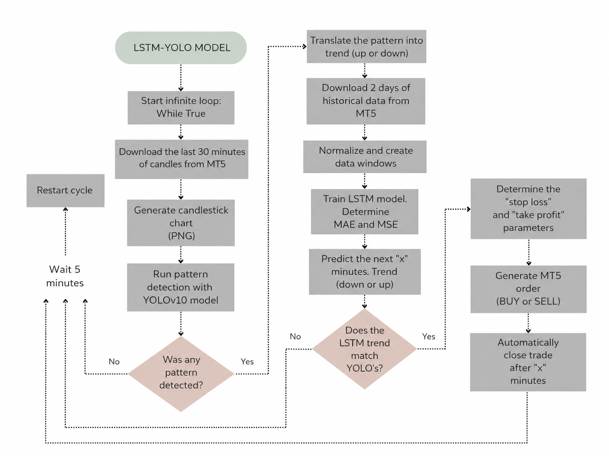

# LSTM-YOLO Forex Trading Bot
 
Automated EUR/USD trading bot that combines **computer vision** and **time-series
forecasting**. A YOLOv10 detector reads candlestick charts to find classic price
patterns, while an LSTM predicts the short-term trend. The bot only trades when both
models agree, and executes orders in real time through MetaTrader 5.
 
> It places real MT5 orders, so treat it as educational.

## Stack
 
`Python` · `TensorFlow/Keras (LSTM)` · `Ultralytics YOLOv10` · `MetaTrader5 API` ·
`scikit-learn` · `pandas / numpy` · `mplfinance`
 
## What it does 
 
1. Pulls the last 30 minutes of EUR/USD candles from MT5 and renders them as an image.
2. **YOLOv10** detects a chart pattern (head_and_shoulders, double_top, double_bottom, cup_and_handle, and rounding_bottom) and maps it to a trend.
3. **LSTM** predicts the next few minutes of the closing price, producing a second trend.
4. If both trends match, the system opens a BUY/SELL order with automatic Stop Loss and Take Profit, holds it, and then closes it.

**Workflow diagram:**

 
 
 ## LSTM network architecture

| Layer | Type    | Parameters              | Output   | Activation |
|-------|---------|-------------------------|----------|------------|
| 0     | Input   | shape = (60, 5)         | (60, 5)  | –          |
| 1     | LSTM    | 64 units, return_seq    | (60, 64) | tanh       |
| 2     | Dropout | rate = 0.2              | (60, 64) | –          |
| 3     | LSTM    | 32 units                | (32)     | tanh       |
| 4     | Dropout | rate = 0.2              | (32)     | –          |
| 5     | Dense   | 16 units                | (16)     | ReLU       |
| 6     | Dense   | 1 unit                  | (1)      | linear     |
 
 ## YOLOv10 model
Trained on candlestick chart images labeled with technical patterns using **Roboflow**. A 640 × 640 pixel input size was used, along with auto-orientation and random rotations between −15° and 15°.

## Results
 
Tested live for 1 day, and because YOLO is selective only 3 valid setups appeared where both
models agreed. We obtain that 2 of 3 trades closed on the right side (~66% hit rate). LSTM test error: **MAE 0.031**, **MSE 0.0019**.
 
| Trade | Profit (MT5) |
|-------|--------------|
| 1 | +20.10 |
| 2 | −3.00  |
| 3 | +65.00 |
 
>this shows
the pipeline runs end to end, not that the strategy is profitable.

 

